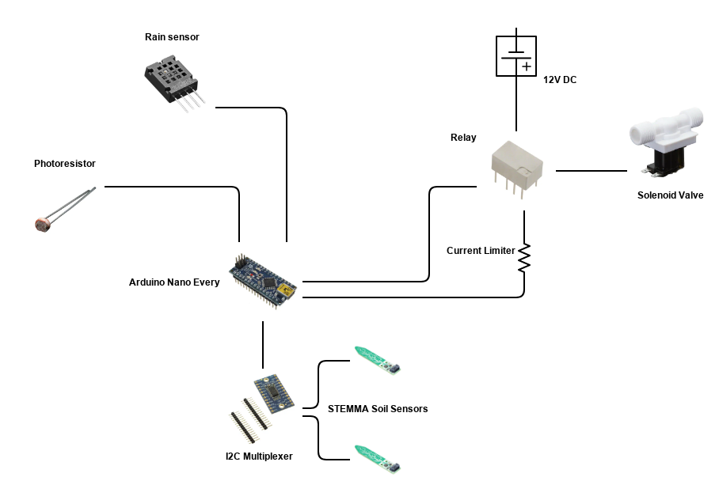
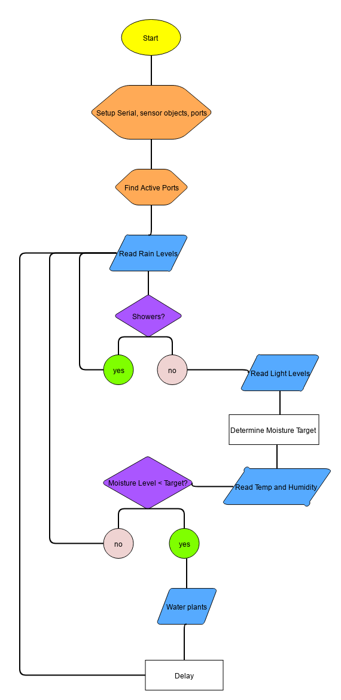

# ShowHerb 

ShowHerb is an automated garden watering system. It uses Adafruit's STEMMA I2C soil sensors, reporting soil moisture levels and temperature. 

The control structure uses an Arduino nano, as well as a TCA I2C multiplexer to allow up to 8 sensors to be added. The electromechanical irrigation valve is controlled by a 5V relay, also controlled by the Arduino.

## System Diagram: 

## Code Structure: 

The Stemma Soil Sesors have custom 3d printed covers to protect their circuitry. Additionally, the control box is custom 3D printed to allow for clean and precise wiring organization, as are the peripheral sensor housings.

Further details are available on my website [here.](https://www.markhofmeister.com/showherb)

